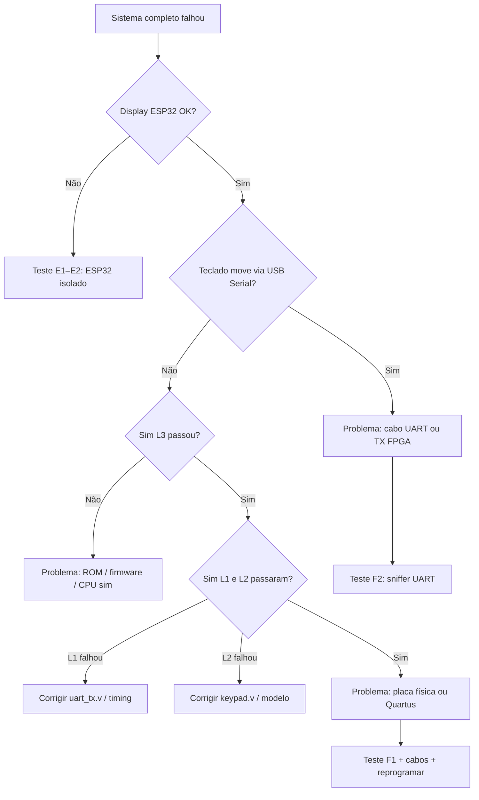

# ArDOOMino — Guia de teste para aula

Montagem **FPGA (DE2-115) + teclado + ESP32 (raycaster)** com roteiro de **setup**, **testes por componente** e **diagnóstico em caso de falha**.

---

## Como usar este guia

| Situação | Onde ir |
|----------|---------|
| Montar tudo pela primeira vez | [§4 Setup completo](#4-setup-completo-happy-path) |
| Algo falhou no teste final | [§5 Árvore de diagnóstico](#5-árvore-de-diagnóstico) |
| Testar um módulo isolado | [§6 Testes por componente](#6-testes-por-componente) |
| Build separado por camada | [§6.0 Módulos compilados separadamente](#60-módulos-compilados-separadamente) |
| Checklist pré-aula (o que já está pronto) | [docs/PRE_AULA.md](docs/PRE_AULA.md) |
| T1/T2 na placa (UART + teclado) | [docs/PHYSICAL_TESTS.md](docs/PHYSICAL_TESTS.md) |
| Referência de cabos e teclas | [§2 Hardware](#2-hardware) |

**Ideia central:** subir a pilha camada a camada. Se o nível *N* falha, não avance para *N+1* — volte ao teste isolado daquela camada.

**Simulação vs placa:** os testes **Icarus L1–L3** rodam no PC (automatizados) e cobrem UART, keypad e CPU+ROM **sem hardware**. Você só precisa fazer na bancada os testes físicos **T1** (beacon UART) e **T2** (teclado→UART). Roteiro OpenSpec: `openspec/changes/validate-uart-hardware/tasks.md`. Sim no PC: `scripts\run_fpga_sim.ps1`.

```
PC sim (L1-L3 auto) → ROM → FPGA programada → ESP32 sniffer → T1/T2 físicos → jogo completo
```

---

## 1. O que você precisa

| Item | Função |
|------|--------|
| Placa **DE2-115** | CPU MIPS + keypad + UART TX |
| **ESP32** + display **ST7789** 240×240 | Raycaster |
| Cabos USB + **2 jumpers** (GND + UART) | Programação e link serial |
| PC: **Quartus**, **PlatformIO**, **make/gcc** | Build |
| *(Opcional)* adaptador **USB‑serial 3.3 V** | Ver bytes da FPGA sem ESP32 |

Pastas:

| Pasta | Conteúdo |
|-------|----------|
| `C:\Projetos\Quartus` | Verilog, Quartus (`ProcessadorMIPS.qpf`), sim Icarus (`sim/`) |
| `C:\Projetos\Compilador\156711` | Compilador C → ROM (`make run`) |
| `C:\Projetos\ArDOOMino\raycaster` | Jogo ESP32 (PlatformIO) |
| `C:\Projetos\ArDOOMino\tools\uart_sniffer` | Sketch mínimo UART (T1/T2) |
| `C:\Projetos\ArDOOMino\scripts` | `run_fpga_sim.ps1`, `build_rom.ps1` |
| `C:\Projetos\ArDOOMino\openspec` | Plano de validação UART / specs |
| `C:\Projetos\Quartus\PINAGEM_DE2-115.md` | Pinagem oficial da placa |

---

## 2. Hardware

### 2.1 Display → ESP32

| Display | ESP32 |
|---------|-------|
| VCC | 3.3 V |
| GND | GND |
| SCL | GPIO **18** |
| SDA / MOSI | GPIO **23** |
| RES | GPIO **16** |
| DC | GPIO **17** |
| BLK | 3.3 V *(obrigatório — sem isso tela preta)* |

### 2.2 FPGA ↔ ESP32 (UART 115200 8N1)

| DE2-115 | ESP32 |
|---------|-------|
| **GPIO[35]** (`PIN_AG26`, saída `uart_tx`) | **GPIO 32** (RX do `Serial2`) |
| **GND** | **GND** |

- Comunicação **unidirecional**: FPGA transmite, ESP32 recebe.
- **Não** conectar GPIO 33 (TX do ESP32) à FPGA.
- Tensão **3.3 V** em ambos os lados.

### 2.3 DE2-115

- Teclado **4×4** no header GPIO (JP5); pinagem em `Quartus\PINAGEM_DE2-115.md`.
- **SW[17]** (`PIN_Y23`) — switch **mais à esquerda** da fileira: **UP** = CPU roda, **DOWN** = reset.
- **KEY[0]** (`PIN_M23`) — botão da instrução `INPUT` (não é reset).
- Após programar a FPGA, deixe **SW[17] para cima** (UP).
- Top do Quartus: sempre **`CPU`** (não use o projeto antigo com top `keypad` isolado).

### 2.4 LEDs de debug do teclado

Com o bitstream atual (`CPU` + `ledr`/`ledg`), o teclado acende LEDs **sem depender da ROM**:

| LED | Tecla / função |
|-----|----------------|
| **LEDG[0]–[7]** | 8, 2, 4, 6, 7, 9, *, # |
| **LEDG[8]** | Qualquer tecla pressionada |
| **LEDR[15:0]** | Máscara one-hot bruta (debug avançado) |

Use no **T2** junto com o sniffer UART. Detalhes em [docs/PHYSICAL_TESTS.md](docs/PHYSICAL_TESTS.md).

### 2.5 Mapa tecla → jogo

| Tecla | Ação | UART |
|:-----:|------|:----:|
| 8 | Frente | `W` |
| 2 | Trás | `S` |
| 4 | Esquerda | `A` |
| 6 | Direita | `D` |
| 7 | Girar esq. | `Q` |
| 9 | Girar dir. | `E` |
| * | Atirar | `F` |
| # | Ação | `R` |
| Soltar | Parar | espaço |

---

## 3. Comandos rápidos

```powershell
# Simulação Icarus (L1–L3) — a partir de ArDOOMino
powershell -ExecutionPolicy Bypass -File C:\Projetos\ArDOOMino\scripts\run_fpga_sim.ps1
powershell -ExecutionPolicy Bypass -File C:\Projetos\ArDOOMino\scripts\run_fpga_sim.ps1 -Level 1   # só uart_tx
powershell -ExecutionPolicy Bypass -File C:\Projetos\ArDOOMino\scripts\run_fpga_sim.ps1 -Level 2   # só keypad

# ROM → Quartus\rom_os.txt
powershell -ExecutionPolicy Bypass -File C:\Projetos\ArDOOMino\scripts\build_rom.ps1 -Target beacon      # T1
powershell -ExecutionPolicy Bypass -File C:\Projetos\ArDOOMino\scripts\build_rom.ps1 -Target controller # T2 / jogo

# Alternativa manual (compilador)
cd C:\Projetos\Compilador\156711
make run ardoomino_controller.c
Copy-Item binary_output.txt C:\Projetos\Quartus\rom_os.txt -Force

# ESP32 — sniffer (T1/T2)
cd C:\Projetos\ArDOOMino\tools\uart_sniffer
pio run -t upload
pio device monitor -b 115200

# ESP32 — jogo (após T1+T2)
cd C:\Projetos\ArDOOMino\raycaster
pio run -t upload
pio device monitor -b 115200
```

Se `pio` não estiver no PATH: `& "$env:USERPROFILE\.platformio\penv\Scripts\pio.exe" run -t upload`

---

## 4. Setup completo (happy path)

### 4.1 Caminho em etapas (recomendado na aula)

Validar UART e teclado **antes** do jogo:

| Etapa | O quê | Critério |
|-------|--------|----------|
| PC | `run_fpga_sim.ps1` (L1–L3) | `ALL SELECTED TESTS FINISHED` |
| **T1** | ROM beacon + FPGA + `uart_sniffer` | Monitor mostra `U` contínuo |
| **T2** | ROM controller + FPGA + sniffer | Tecla 8 → `W`; LEDs §2.4 acendem |
| **Jogo** | Mesma ROM controller + `raycaster` | Personagem responde ao keypad |

Roteiro T1/T2: [docs/PHYSICAL_TESTS.md](docs/PHYSICAL_TESTS.md).

### 4.2 Sistema completo (meta final)

1. **ROM** — `build_rom.ps1 -Target controller` *(não use `rom_os_kernel.txt` — é o SO, não o controller.)*
2. **FPGA** — Quartus: `ProcessadorMIPS.qpf` → Compile → Programmer → `.sof` → **SW[17] UP**.
3. **ESP32** — upload em `raycaster/`.
4. **Cabos** — GND + GPIO35 (FPGA) → GPIO32 (ESP32).
5. **Teste** — mapa no display; tecla **8** move; soltar para.

**Critério de sucesso:** personagem responde ao keypad e para ao soltar.

---

## 5. Árvore de diagnóstico

Use quando o teste final (§4) falhar. Siga de cima para baixo até achar a camada quebrada.



### Tabela sintoma → camada

| Sintoma | Camada provável | Teste isolado |
|---------|-----------------|---------------|
| Tela preta | ESP32 / display | [E1](#e1-display-e-boot-do-esp32) |
| Jogo visível, nada responde | UART ou ROM | [E3](#e3-controle-via-usb-serial) depois [F2](#f2-uart-da-fpga-sniffer) |
| Responde no USB, não no keypad | Cabo / FPGA TX | [F2](#f2-uart-da-fpga-sniffer) |
| Sim L3 falha | ROM ou Verilog | [C1](#c1-compilador--rom) + [S3](#s3-l3--cpu--rom--keypad--uart) |
| Sim L1 falha | Módulo `uart_tx` | [S1](#s1-l1--módulo-uart-tx) |
| Sim L2 falha | Módulo `keypad` | [S2](#s2-l2--módulo-keypad) |
| FPGA “travada” / loop | ROM errada (kernel) | [C1](#c1-compilador--rom) |
| Movimento sem parar | Release / keypad latch | [S2](#s2-l2--módulo-keypad) + tecla solta |

---

## 6. Testes por componente

Cada bloco tem: **objetivo**, **como rodar**, **passou**, **falhou → corrigir**.

---

### 6.0 Módulos compilados separadamente

Nem toda camada exige o sistema inteiro. Use **build + teste isolado** antes de integrar.

| Módulo | Compilar separado? | Como testar | Equivale a |
|--------|-------------------|-------------|------------|
| **`uart_tx.v`** | Sim (só Icarus, não Quartus) | `run_fpga_sim.ps1 -Level 1` | [S1](#s1-l1--módulo-uart-tx) |
| **`keypad.v`** | Sim (só Icarus) | `run_fpga_sim.ps1 -Level 2` | [S2](#s2-l2--módulo-keypad) |
| **`CPU` + ROM** | Sim (Icarus L3) | `run_fpga_sim.ps1 -Level 3` | [S3](#s3-l3--cpu--rom--keypad--uart) |
| **`uart_beacon.c`** | `build_rom.ps1 -Target beacon` | T1 na placa + sniffer | Link UART |
| **`ardoomino_controller.c`** | `build_rom.ps1 -Target controller` | T2 na placa + LEDs §2.4 + sniffer | Teclado + UART |
| **`tools/uart_sniffer`** | `pio run` em pasta própria | T1/T2 sem TFT | [F2](#f2-uart-da-fpga-sniffer) |
| **`raycaster`** | `pio run` em pasta própria | E1/E2 sem FPGA | [E1](#e1-display-e-boot-do-esp32) |
| **Quartus síntese** | Sempre top **`CPU`** | Não há projeto mantido com top só `keypad` | L2 cobre o Verilog do teclado |

**Quartus:** compilar só `keypad.v` na placa exigiria trocar `TOP_LEVEL_ENTITY` e o `.qsf` (projeto legado no git, commit `4973e76`). No fluxo atual, **L2 substitui** essa síntese isolada no PC.

**Compilador:** cada `.c` gera ROM distinta:

```powershell
cd C:\Projetos\Compilador\156711
make run uart_beacon.c          # ~26 linhas em binary_output.txt
make run ardoomino_controller.c # ~78 linhas
```

Inspecione `assembly_output.asm` (deve ter `LCD_WRITE_CHAR` no beacon; `READ_KEYPAD` + `LCD_WRITE_CHAR` no controller).

**ESP32:** são **dois projetos PlatformIO** independentes — grave o sniffer para T1/T2 e o raycaster só depois.

---

### C — Compilador e ROM (sem placa)

#### C1 — Compilador + ROM

**Objetivo:** garantir que o firmware C vira o binário certo para a FPGA.

```powershell
cd C:\Projetos\Compilador\156711
make run ardoomino_controller.c
```

**Passou se:**

- Comandos terminam sem erro.
- `assembly_output.asm` contém `READ_KEYPAD` e `LCD_WRITE_CHAR`.
- `binary_output.txt` tem ~**78 linhas** (não centenas como o kernel).
- Último loop é `J` de volta ao `READ_KEYPAD`, **não** `J 157` + `HALT` do kernel.

```powershell
Copy-Item binary_output.txt C:\Projetos\Quartus\rom_os.txt -Force
(Get-Content C:\Projetos\Quartus\rom_os.txt | Measure-Object -Line).Lines
```

**Falhou → corrigir em:** `Compilador/156711` (`ardoomino_controller.c`, `assembler.c`, `bison.y`).

#### C2 — ROM beacon (T1)

```powershell
powershell -ExecutionPolicy Bypass -File C:\Projetos\ArDOOMino\scripts\build_rom.ps1 -Target beacon
```

**Passou se:** `rom_os.txt` com ~**26 linhas**; `assembly_output.asm` com loop e `LCD_WRITE_CHAR` (byte `85` = `'U'`).

---

### S — Simulação no PC (Icarus Verilog)

Requisito: `iverilog` + `vvp` ([Icarus Verilog](https://bleyer.org/icarus/)) ou `run_tests.ps1 -InstallIcarus`.

Todos os testes em `C:\Projetos\Quartus`. Detalhes em `sim/TEST_PLAN.md`.

#### S1 — L1: módulo UART TX

**Objetivo:** validar `uart_tx.v` isolado — idle alto, bytes `W`/`S`/espaço, sem erro de framing.

```powershell
powershell -ExecutionPolicy Bypass -File C:\Projetos\ArDOOMino\scripts\run_fpga_sim.ps1 -Level 1
```

**Passou se:** `*** ALL TESTS PASSED ***`, 0 framing errors.

**Falhou → corrigir em:** `Quartus/uart_tx.v`, `sim/uart_monitor.v`, `sim/tb_uart_tx.v`.

---

#### S2 — L2: módulo keypad

**Objetivo:** scanner + latch do teclado; cada tecla do jogo gera o one-hot correto e release zera.

```powershell
powershell -ExecutionPolicy Bypass -File C:\Projetos\ArDOOMino\scripts\run_fpga_sim.ps1 -Level 2
```

**Passou se:** 16/16 checks (8 teclas + 8 releases). Tecla 7 = `0x0100`.

**Falhou → corrigir em:** `Quartus/keypad.v`, `sim/keypad_model.v`, `sim/tb_keypad.v`.

---

#### S3 — L3: CPU + ROM + keypad + UART

**Objetivo:** integração completa **sem hardware** — pressionar tecla virtual → byte UART esperado.

**Pré-requisito:** [C1](#c1-compilador--rom) com `rom_os.txt` atualizado.

```powershell
powershell -ExecutionPolicy Bypass -File C:\Projetos\ArDOOMino\scripts\run_fpga_sim.ps1 -Level 3
```

**Passou se:** `15/15` (8 teclas + release + `#`/`R`).

**Falhou → corrigir em:**

| Falha | Onde olhar |
|-------|------------|
| Timeout UART, CPU roda | `rom_os.txt` errado, `ProgramCounter.v`, `Controle.v` |
| Tecla errada | `ardoomino_controller.c`, mapa §2.5 |
| Só L3 falha, L1/L2 OK | `CPU.v` (ligação UART), `ROMSinglePort.v` |

**Ordem recomendada se L3 falha:** S1 → S2 → C1 → S3 (nunca pule L1/L2).

---

### E — ESP32 isolado (sem FPGA)

Desconecte o jumper UART da FPGA. Alimente só o ESP32.

#### E0 — Sniffer UART (sem display, sem jogo)

**Objetivo:** validar só `Serial2` (GPIO 32) — usado em **T1** e **T2**.

```powershell
cd C:\Projetos\ArDOOMino\tools\uart_sniffer
pio run -t upload
pio device monitor -b 115200
```

**Passou se:** mensagem de boot no monitor USB; com FPGA ligada (T1/T2), aparecem linhas `RX: 0x..`.

**Falhou → corrigir em:** `tools/uart_sniffer/src/main.cpp`, cabo §2.2, baud 115200.

---

#### E1 — Display e boot do ESP32

**Objetivo:** hardware do display e firmware base.

```powershell
cd C:\Projetos\ArDOOMino\raycaster
platformio run --target upload
```

**Passou se:** tela acende, mapa do jogo visível (letterbox preto em cima/baixo).

**Falhou → corrigir em:** cabos §2.1 (especialmente **BLK**), `platformio.ini`, `raycaster/`.

---

#### E2 — Serial USB (monitor)

**Objetivo:** loop do jogo e parsing de input funcionam **sem** FPGA.

```powershell
platformio device monitor -b 115200
```

No monitor, envie: `W` → personagem anda; ` ` (espaço) → para.

**Passou se:** movimento obedece à tabela §2.5 via teclado do PC.

**Falhou → corrigir em:** `raycaster/src/main.cpp` (`applyInputChar`, `receiveData`).

---

#### E3 — Controle via USB Serial

**Objetivo:** confirmar que o jogo **não** depende da FPGA para lógica de movimento.

Mesmo teste que E2. Se E1+E2 passam, o ESP32 está OK.

**Se E2 passa mas sistema completo não:** problema está na **FPGA** ou no **cabo UART**, não no jogo.

---

### F — FPGA isolada (sem depender do jogo)

#### F1 — Programação Quartus

**Objetivo:** bitstream válido na DE2-115.

1. [C1](#c1-compilador--rom) feito.
2. Quartus → Compile → Programmer → 100% success.
3. Reset na placa.

**Passou se:** placa programa sem erro; após reset, CPU executa (sem travamento visível — difícil ver sem UART).

**Falhou → corrigir em:** erros de sintese no Quartus, pinos em `ProcessadorMIPS.qsf`.

---

#### F2 — UART da FPGA (sniffer)

**Objetivo:** ver bytes reais na saída `uart_tx`.

Roteiro completo: **[docs/PHYSICAL_TESTS.md](docs/PHYSICAL_TESTS.md)** (T1 beacon, depois T2 teclado).

**T1 — só UART:** `scripts\build_rom.ps1 -Target beacon` → Quartus → sniffer em `tools\uart_sniffer` → fluxo de `U` no monitor.

**T2 — teclado:** `build_rom.ps1 -Target controller` → mesma FPGA → tecla **8** deve mostrar `W` no sniffer.

**Opção A — ESP32 sniffer** *(recomendado)*  
```powershell
cd C:\Projetos\ArDOOMino\tools\uart_sniffer
pio run -t upload
pio device monitor -b 115200
```
Cabo: GND + GPIO35 (FPGA) → GPIO32 (ESP).

**Opção B — jogo como receptor** *(após T1/T2 OK)*  
1. Suba o raycaster ([E1](#e1-display-e-boot-do-esp32)).  
2. Pressione **8** no keypad — personagem anda se F2 já passou com `tools/uart_sniffer`.

**Opção C — Adaptador USB‑serial 3.3 V** *(debug sem ESP32)*  
1. FPGA GND → GND do adaptador.  
2. GPIO35 (TX FPGA) → **RX** do adaptador.  
3. Terminal serial **115200 8N1**.  
4. Pressione **8** → deve aparecer `W`; solte → espaço.

**Passou se:** bytes corretos conforme §2.5.

**Falhou → corrigir em:**

| Observação | Causa provável |
|------------|----------------|
| Nenhum byte | ROM errada, `uart_tx.v`, ligação `CPU.v` → `lcd_write_enable` |
| Lixo / baud errado | 115200, TX idle em nível **alto** |
| Byte errado por tecla | `keypad.v`, `ardoomino_controller.c` |
| Só no sniffer falha, sim OK | Quartus não recompilou após trocar `rom_os.txt` |

---

#### F3 — Keypad na placa

**Objetivo:** confirmar leitura física do matricial.

1. [S2](#s2-l2--módulo-keypad) no PC — prova o Verilog.
2. **LEDs §2.4** — ao pressionar tecla **8**, **LEDG[0]** e **LEDG[8]** acendem; ao soltar, apagam (com pequeno atraso do scanner).
3. [F2](#f2-uart-da-fpga-sniffer) — mesma tecla gera `W` no sniffer.

**Passou se:** LEDs §2.4 corretos **e** byte UART conforme §2.5.

**Falhou → corrigir em:** `ProcessadorMIPS.qsf` (GPIO keypad), `keypad.v`, ou cabo/header JP5.

---

### L — Link FPGA → ESP32

**Pré-requisitos:** E1+E2 OK, F2 OK (bytes corretos no sniffer ou tecla 8 → `W`).

1. GND comum **obrigatório**.
2. GPIO35 → GPIO32 (único fio de sinal).
3. Suba ESP32 com jogo; FPGA programada e resetada.
4. **Não** abra monitor USB enviando `W` ao mesmo tempo — prioridade é `Serial2`, mas debug fica confuso.

**Passou se:** keypad da FPGA controla o jogo; soltar para.

**Falhou → corrigir em:**

| E2 OK, F2 OK, link falha | Verificar |
|--------------------------|-----------|
| Cabo solto / GPIO errado | GPIO **32** = RX, não 33 |
| GND ausente | Referência comum |
| Baud | 115200 nos dois lados |

---

## 7. Matriz de decisão rápida

| S1 | S2 | S3 | E1 | E2 | F2 | Diagnóstico |
|:--:|:--:|:--:|:--:|:--:|:--:|-------------|
| ✓ | ✓ | ✓ | ✓ | ✓ | ✗ | FPGA / ROM na placa / Quartus |
| ✓ | ✓ | ✗ | — | — | — | ROM ou integração Verilog |
| ✗ | — | — | — | — | — | `uart_tx.v` |
| — | ✗ | — | — | — | — | `keypad.v` |
| ✓ | ✓ | ✓ | ✓ | ✓ | ✓ | Cabo ESP32↔FPGA ou prioridade serial |
| ✓ | ✓ | ✓ | ✗ | — | — | Display / ESP32 hardware |

*(✓ = passou, ✗ = falhou, — = não testado ainda)*

---

## 8. Checklist antes da apresentação

**No PC (5 min):**

- [ ] `run_fpga_sim.ps1` — L1 + L2 + L3 passam
- [ ] [C1](#c1-compilador--rom) — ROM controller ~78 linhas
- [ ] [C2](#c2--rom-beacon-t1) — ROM beacon ~26 linhas (opcional antes da aula)

**Na bancada (UART antes do jogo):**

- [ ] [E0](#e0--sniffer-uart-sem-display-sem-jogo) — sniffer sobe
- [ ] [F1](#f1--programação-quartus) — FPGA programada (top `CPU`)
- [ ] **T1** — beacon + sniffer (`PHYSICAL_TESTS.md`)
- [ ] **T2** — controller + sniffer + LEDs §2.4
- [ ] Jumpers: **GND** + **GPIO35 → GPIO32**

**Sistema completo:**

- [ ] [E1](#e1-display-e-boot-do-esp32) — raycaster no display
- [ ] Tecla **8** anda; soltar para

---

## 9. Problemas comuns (referência)

| Sintoma | Primeiro teste | Correção típica |
|---------|----------------|-----------------|
| Tela preta | E1 | BLK em 3.3 V, reupload |
| Jogo OK, keypad morto | F2 | ROM, cabo UART, GND |
| Sim OK, placa não | F1 + F2 | Recompilar Quartus após trocar ROM |
| Loop / FPGA “travada” | C1 | `rom_os.txt` ≠ kernel |
| Movimento não para | S2, F3 | Soltar tecla; `keypad.v` latch |
| `make` não encontrado | — | Git Bash / MSYS com `make` no PATH |
| `iverilog` não encontrado | — | `run_tests.ps1 -InstallIcarus` ou reiniciar terminal |

---

## 10. Fluxo sugerido na aula (com tempo)

| Tempo | Atividade |
|-------|-----------|
| 0–5 min | `run_fpga_sim.ps1` + C1/C2 no PC |
| 5–10 min | F1 FPGA + E0 sniffer; **T1** beacon |
| 10–15 min | **T2** teclado (LEDs + sniffer) |
| 15–20 min | E1 raycaster + **L** link jogo completo |
| Se falhar | §5 árvore ou [§6.0](#60-módulos-compilados-separadamente) (módulo isolado) |

Boa aula.
